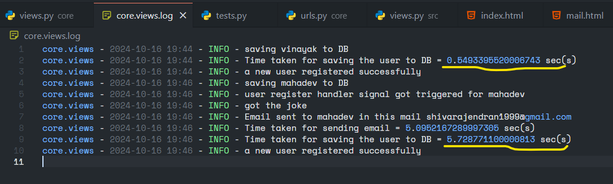

### Question 1: By default are django signals executed synchronously or asynchronously?

Yes, Django signals are executed **synchronously**. When a particular event occurred, signal will be triggered, all connected receivers are called in the order they were registered, and the sender waits for these receivers to complete before continuing remaining activity.

- Lets add signals for the above user creation scenario, where when user details saved to DB, a success email will be sent to user along with the fetched joke.

```python
@receiver(post_save, sender=User)
def user_register_handler(sender, instance, created, *args, **kwargs):
	'''
	when a signal is triggered, below details will be logged to log file
	to indicate the flow happens synchronously
	'''
    logger.info(f"user register handler signal got triggered for {instance.username}")

    if created:
        if instance.is_superuser: pass
        else:
			# tracking the start time for sending mail
            start_time = pc()
            user = sender.objects.get(id=instance.id)

			# getting a random joke from the API
            joke = get_joke()

			# email details
            subject = "Example Mail with JOKE!"
            message = render_to_string('core/mail.html', {'user':user.username, 'joke':joke})
            email = EmailMessage(subject, message, to=[user.email,])

            if email.send():
                logger.info(f"Email sent to {user.username} in this mail {user.email}")
            else:
                logger.error("There was a problem in sending a mail")
               
            # Elapsed time for sending mail
            logger.info(f"Time taken for sending email = {pc() - start_time} sec(s)")
```

- When user details saved to DB, a `post_save` signal is triggered. Email will be sent along with the joke. Elapsed time is capture in the log to show the flow happens **synchronously**.
- Now let's create a dummy user in the website and check the log file for user creation time along with sending email.



- For second user (Mahadev), time taken for sending mail took **5.095 secs**, whereas time taken for complete user account creation took **5.728 secs**.
- Another important observation is for previous user **(Vinayak)**, account creation process took **0.5 secs** without email, whereas for this user **(Mahadev)** it took **5.7 secs which includes sending mail using django signal**s.
- Hence django signals by default execute **synchronously**.

	**For above code refer this file** --> [project/core/views.py](project/core/views.py).

	**For log file refer** [project/core.views.log_result](project/core.views.log_result).


---
