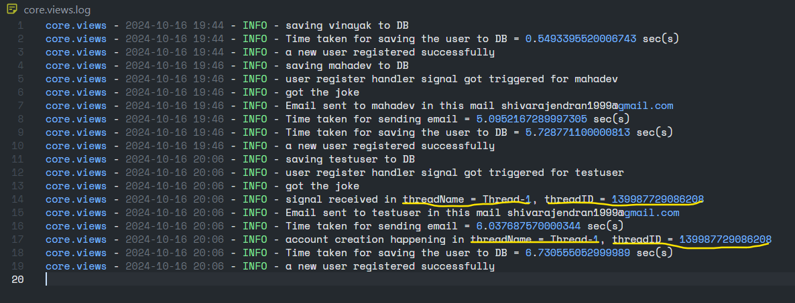

### Question 2: Do django signals run in the same thread as the caller?

Yes, by default, Django signals run in the **same thread as the caller**. When a signal is sent, the connected receivers are executed immediately in the context of the current thread. It blocks main flow's execution and execute the signal's receiver. So if a request is made, then signal receivers will run in the same thread handling that request.

- we can use the threading module to verify whether user creation process & signal handler are executed in the same thread or not.

```python
@receiver(post_save, sender=User)
def user_register_handler(sender, instance, created, *args, **kwargs):
    logger.info(f"user register handler signal got triggered for {instance.username}")

    if created:
        if instance.is_superuser: pass
        else:
            start_time = pc()
           
            user = sender.objects.get(id=instance.id)
            joke = get_joke()
           
            subject = "Example Mail with JOKE!"
            message = render_to_string('core/mail.html', {'user':user.username, 'joke':joke})
            email = EmailMessage(subject, message, to=[user.email,])

			# we getting the current thread where the signal handler is executing
            current_thread = threading.current_thread()
           
			# capturing current thread's Name & ID in the log file (Email)
            logger.info(f"signal received in threadName = {current_thread.name}, threadID = {current_thread.ident}")

            if email.send():
                logger.info(f"Email sent to {user.username} in this mail {user.email}")
            else:
                logger.error("There was a problem in sending a mail")

            logger.info(f"Time taken for sending email = {pc() - start_time} sec(s)")
           

def sign_up(request):
    if request.method == 'POST':
        form = CustomUserCreationForm(request.POST)

        if form.is_valid():
            start_time = pc()

            logger.info(f"saving {form.cleaned_data.get('username', 'N/A')} to DB")
            form.save()

			# getting the current thread where the signup process is executing
            current_thread = threading.current_thread()

			# capturing current thread's Name & ID in the log file (User SIGNUP)
            logger.info(f"account creation happening in threadName = {current_thread.name}, threadID = {current_thread.ident}")

            logger.info(f"Time taken for saving the user to DB = {pc() - start_time} sec(s)")
            logger.info("a new user registered successfully")

            return redirect('home')
        else:
            logger.info("problem in submitting the form")
    else:
        form = CustomUserCreationForm()

    context = {'form': form}
    return render(request, 'core/forms.html', context)
```

- In the above code, we capturing the current thread's details running for user account creation flow and signal handler flow.
- Now let's create another user and check the log file for thread details




- For this user **(testuser)**, both account creation flow & email sending flow happened in the same thread with name `Thread-1` and thread ID `139987729086208`.
- Hence the above example will show django signals run in the **same thread as the caller**.

	**For above code refer this file** --> [project/core/views.py](project/core/views.py).

	**For log file refer** [project/core.views.log_result](project/core.views.log_result).


---
