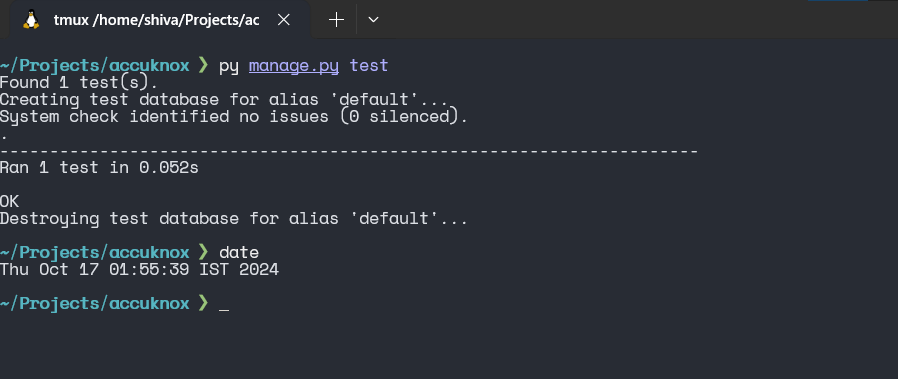

### Question 3: By default do django signals run in the same database transaction as the caller?

- Yes, Django signals run in the **same database transaction as the caller**. This means that if signal connected to a model's save or delete operation, any database operations performed within the signal handler will be part of the same transaction.
- If an exception is raised in the signal handler, it can **roll back the transaction initiated by the calling operation**.
- Let's create another signal using `pre_save`. Before saving user details to DB, we check if username contains only alphabets in the newly created signal handler.
- If there is only letters in the username, it will not do anything. If username contains digits, the signal handler will raise the **exception** and captures the error info.

```python
@receiver(pre_save, sender=User)
def user_valid_handler(sender, instance, *args, **kwargs):

	# Rasing exception if username contains digits in it
    if not instance.username.isalpha():
        logger.error(f"{instance.username} -> username should only contains letters")
        raise Exception("Username should only contains letters")
```

- Now we write a test where we create a dummy user with username containing both digits and letters. After creation, we will check if user is present in the DB or not.
- Ideally the test user should not be present because signal runs in same DB transaction as the caller.

```python
# tests.py
from django.test import TestCase
from django.contrib.auth.models import User

class UserAccountCreation(TestCase):
	'''Test for creating user'''

    def test_user_creation_failed_signal(self):
		'''
		test should fail if username contains digits other than alphabets
		'''

		# Before creating we make sure that DB doesn't have test user
        self.assertEqual(User.objects.filter(username="TestUser_1234").exists(), False)

        with self.assertRaises(Exception):
            User.objects.create(username="TestUser_1234", email='testuser@example.com', password='Test@1234')

		# Checking whether test user present in DB
        self.assertEqual(User.objects.filter(username="TestUser_1234").exists(), False)
```



- test ran without any failure.
- Hence Django signals run in the **same database transaction as the caller**.

	**For above code refer this file** --> [project/core/views.py](project/core/views.py).

	**For log file refer** [project/core.views.log_result](project/core.views.log_result).

	**For tests refer this file** --> [project/core/tests.py](project/core/tests.py).
---