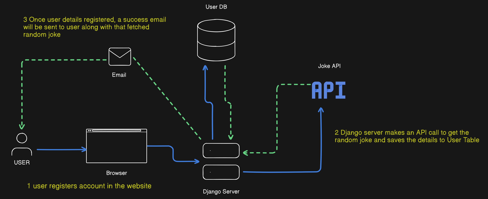
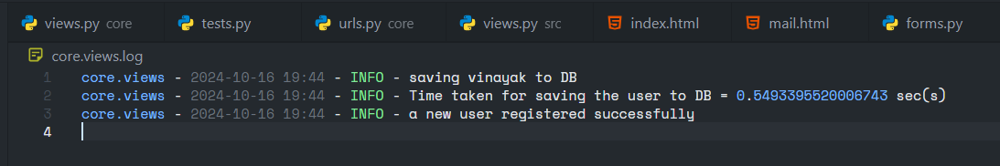

Let's consider an example for answering the below questions related to signals.




You can refer the above diagram for better understanding. When a user create account in the website. User details are validated and after saving to DB successfully, a request is made to get a random joke from JOKE API and a success email message will be sent to the user along with that fetched joke.

We can use Django signals for the above scenario for sending mail to user for successful account creation.


## setup

- Let's import the necessary tools & functions

```python
from django.shortcuts import render
from django.contrib.auth.models import User
from django.db.models.signals import post_save, pre_save
from django.dispatch import receiver
from django.template.loader import render_to_string
from django.core.mail import EmailMessage
from django.shortcuts import redirect

from .forms import CustomUserCreationForm

from time import perf_counter as pc
import requests
import logging
import threading
```

- Now create a logger for tracking the results

```python
logger = logging.getLogger(__name__)
logger.setLevel(logging.DEBUG)

fileHandler = logging.FileHandler(f'{__name__}.log', mode='a', encoding='utf-8')
formatter = logging.Formatter("{name} - {asctime} - {levelname} - {message}", style="{", datefmt="%Y-%m-%d %H:%M",)

fileHandler.setFormatter(formatter)
logger.addHandler(fileHandler)
```

- Now to get the random joke, we use requests library to fetch the joke

```python
URL = "https://icanhazdadjoke.com/"
timeouts = (4, 5)

def get_joke() -> str:

    try:
        res = requests.get(URL, headers={'Accept': 'application/json'}, timeout=timeouts)
    except TimeoutError:
        logger.error("There was a problem in getting a joke")
        return "Connection got timed out, pls after sometime"

    if res.status_code == 200:
        logger.info("got the joke")
    return res.json().get('joke', '')
```

- Now we create a simple signup view

```python
def sign_up(request):
    if request.method == 'POST':
        form = CustomUserCreationForm(request.POST)

        if form.is_valid():
			# tracking start time
            start_time = pc()

            logger.info(f"saving {form.cleaned_data.get('username', 'N/A')} to DB")
            form.save()
           
			# calculating elaspsed time           
            logger.info(f"Time taken for saving the user to DB = {pc() - start_time} sec(s)")

            logger.info("a new user registered successfully")
            return redirect('home')
        else:
            logger.info("problem in submitting the form")
    else:
        form = CustomUserCreationForm()

    context = {'form': form}
    return render(request, 'core/forms.html', context)
```

- Now we check how long it took to complete the account creation for the user with log file.




**The entire flow took 0.5 secs for saving Vinayak's account (test user)**

---
